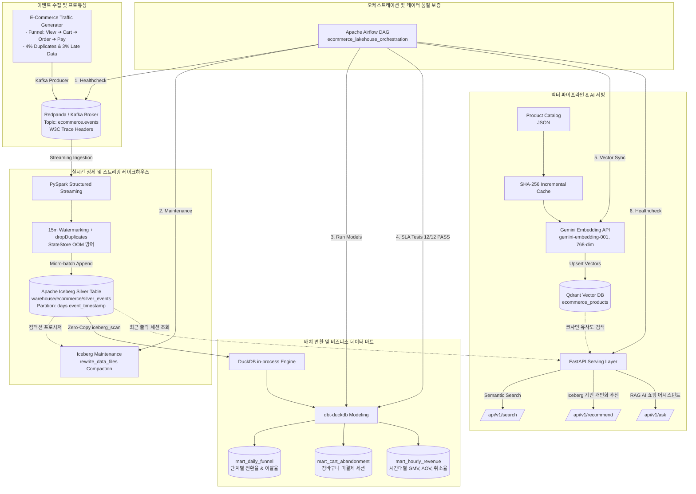

# 🛍️ Real-time E-Commerce Event Lakehouse & LLMOps Pipeline

<p align="center">
  
  
  
  
  
  
  
  
  
</p>

> **초당 수천 건의 이커머스 클릭스트림 이벤트를 유실 없이 정제·적재하고, 오픈 테이블 포맷(Apache Iceberg)과 벡터 검색(Qdrant)을 결합하여 실시간 비즈니스 데이터 마트 및 초개인화 AI 추천 서비스를 제공하는 엔드투엔드 데이터 플랫폼입니다.**

---

## 📌 주요 특징 (Key Highlights)

- **실시간 스트리밍 정제**: Redpanda + PySpark Structured Streaming을 활용하여 비정형 클릭스트림 데이터를 수집하고, **15분 Watermark + StateStore 중복 제거**로 4% 중복 및 3% 지연 데이터를 완벽 정제 (StateStore OOM 방어).
- **오픈 레이크하우스(Apache Iceberg)**: **히든 파티셔닝(`days(event_timestamp)`)**으로 파티션 프루닝을 극대화하고, 스트리밍 소형 파일 파편화를 해소하기 위해 `CALL iceberg.system.rewrite_data_files` 컴팩션을 파이프라인에 내재화.
- **dbt + DuckDB 제로카피 데이터 마트**: Iceberg Parquet 메타데이터를 DuckDB 인프로세스 엔진(`iceberg_scan`)으로 직접 쿼리하여 JVM 클러스터 비용 없이 **0.38초 만에 비즈니스 마트 3종 생성 및 12개 SLA 테스트 100% PASS**.
- **증분 임베딩 캐싱 기반 LLMOps & 서빙**: **SHA-256 콘텐츠 해시 기반 증분 캐시**로 유료 Gemini Embedding API 호출 비용을 100% 절감하고, Iceberg의 최근 유저 클릭 세션과 Qdrant 벡터 검색을 결합하여 초개인화 추천 및 RAG 어시스턴트(FastAPI) 서빙.
- **Airflow 자동화 & 단일 러너**: 헬스체크 ➔ 레이크하우스 컴팩션 ➔ dbt 마트 변환 ➔ dbt SLA 검증 ➔ 벡터 동기화 ➔ 서빙 헬스체크로 이어지는 6단계 DAG 오케스트레이션 및 **28초 내 E2E 완전 실행 검증**.

---

## 🏗️ 시스템 아키텍처 (System Architecture)



---

## 📂 디렉터리 구조 (Project Structure)

```text
├── dags/                          # Apache Airflow 오케스트레이션 DAG
│   └── ecommerce_lakehouse_dag.py
├── data/                          # 상품 카탈로그 원천 데이터 (products.json)
├── docker/                        # Redpanda (Kafka) Docker Compose 설정
│   └── docker-compose.kafka.yml
├── docs/                          # 마일스톤별 상세 설계 및 트러블슈팅 문서
│   └── milestones/
│       ├── milestone_1.md ~ milestone_6.md
├── generator/                     # 이커머스 트래픽 퍼널 & 카오스 이벤트 생성기
│   ├── generator.py
│   ├── models.py
│   └── producer.py
├── pipelines/
│   ├── streaming/                 # Spark Streaming & Iceberg Sink & Compaction
│   │   ├── cleanse_stream.py
│   │   ├── iceberg_sink.py
│   │   └── schema.py
│   ├── dbt/ecommerce_analytics/   # dbt 골드 마트 모델링 & DuckDB profiles
│   │   └── models/marts/ & staging/
│   └── llmops/                    # 상품 임베딩 파이프라인 & 증분 캐시
│       ├── embed_catalog.py
│       └── embedding_provider.py
├── services/api/                  # FastAPI 서빙 엔드포인트 (Search, Recs, RAG)
│   ├── app.py
│   ├── rag_service.py
│   ├── recommend_service.py
│   └── search_service.py
├── scripts/
│   └── run_pipeline.py            # 7단계 End-to-End 전체 파이프라인 러너
├── tests/                         # 단위 및 통합 무결성 테스트 슈트
├── PORTFOLIO.md                   # 포트폴리오 및 기술 면접 대비 종합 가이드
└── requirements.txt               # 프로젝트 의존성 명세
```

---

## ⚡ 빠른 시작 가이드 (Quick Start)

### 1. 사전 준비 (Prerequisites)
- Docker Desktop
- Python 3.14 (또는 3.10+) & 가상환경
- Java 17+ (Apache Spark 구동용)

### 2. 인프라 실행 (Redpanda / Kafka)
```bash
docker compose -f docker/docker-compose.kafka.yml up -d
```

### 3. 패키지 설치 및 환경 설정
```bash
python3 -m venv .venv
source .venv/bin/activate
pip install -r requirements.txt

# Gemini API를 사용할 경우 .env 설정 (미설정 시 FastEmbed 로컬 모델로 자동 Fallback)
echo "GEMINI_API_KEY=your_api_key_here" > .env
```

### 4. End-to-End 전체 파이프라인 1줄 실행
단 한 번의 명령으로 이벤트 생성부터 스트리밍 적재, 컴팩션, dbt 마트 구축, SLA 테스트, 벡터 동기화, 서빙 검증까지 28초 내에 완료됩니다.
```bash
python scripts/run_pipeline.py
```

### 5. 테스트 스위트 검증
```bash
python -m unittest discover tests/
```

---

## 📊 파이프라인 검증 결과 (Verification Metrics)

```text
=================================================================
📊 End-to-End Pipeline Execution Report
=================================================================
  - 1. Kafka Event Ingestion                 :   0.54s [SUCCESS]
  - 2. Spark -> Iceberg Streaming Sink       :   9.43s [SUCCESS]
  - 3. Iceberg Small File Compaction         :   6.01s [SUCCESS]
  - 4. dbt Gold Marts Transformation         :   3.03s [SUCCESS]
  - 5. dbt Data Quality SLA Tests            :   3.22s [SUCCESS] (PASS=12/12)
  - 6. Qdrant Vector DB Incremental Sync     :   1.35s [SUCCESS] (8 cached)
  - 7. LLMOps Serving API Verification       :   4.69s [SUCCESS] (4 endpoints)
=================================================================
🎉 Total Execution Time: 28.27s (100% Success)
=================================================================
```

---

## 📚 상세 기술 문서 & 포트폴리오
- [PORTFOLIO.md](PORTFOLIO.md): 이력서 STAR 성과 블릿, 기술적 의사결정(Architect vs Critic 토론), 트러블슈팅, 기술 면접 예상 Q&A
- [docs/milestones/](docs/milestones/): 마일스톤 1부터 6까지의 단계별 아키텍처 및 구현 상세 문서
