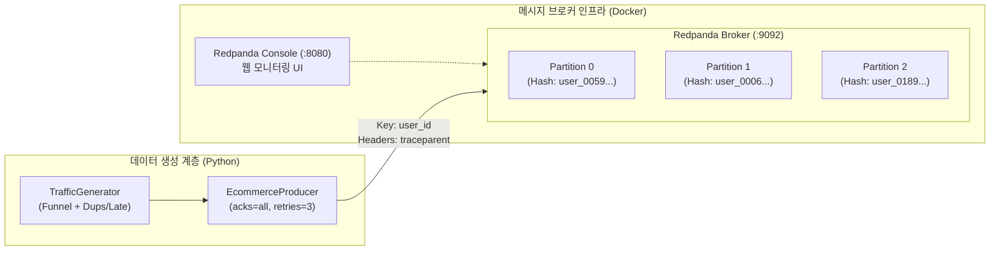

# Milestone 2: Docker 기반 Kafka(Redpanda) 인프라 구축 & 실시간 Producer 연동

> **소요 마일스톤**: Milestone 2  
> **상태**: 완료 (Verified)  
> **핵심 키워드**: Redpanda, Kafka Wire Protocol, Partitioning Key, W3C Trace Context, Idempotent Producer, de-debate

---

## 1. 아키텍처 개요 (Architecture Overview)

Milestone 2에서는 로컬 분산 스트리밍 환경의 인프라를 구축하고, 이커머스 퍼널 트래픽을 실시간으로 브로커에 안정적으로 인입(Ingestion)하는 프로듀서 파이프라인을 완성했습니다.



---

## 2. 기술 스택 선정 및 Trade-off (Why)

### ① 왜 표준 Kafka 대신 Redpanda인가?
* **C++ (Seastar) 기반 무경량 런타임**: JVM 메모리 오버헤드(2~4GB)와 GC 일시 정지(Stop-the-world)가 없어 로컬 리소스(1GB 미만)를 극도로 절약합니다.
* **단일 바이너리 Raft 합의**: ZooKeeper나 복잡한 외부 메타데이터 클러스터 없이 단일 컨테이너로 완전한 Raft 기반 분산 로그를 제공합니다.
* **100% Kafka Wire Protocol 호환**: 애플리케이션 코드(`KafkaProducer`, 추후 `PySpark`)는 기존 표준 Kafka 클라이언트를 수정 없이 그대로 사용할 수 있어 이식성이 완벽합니다.

---

## 3. Architect vs Critic 듀얼 토론을 통한 핵심 설계 결정

우리 프로젝트의 표준 규칙인 `de-debate` 프로토콜을 거쳐 도출된 실무 설계 결정 사항입니다.

| 설계 쟁점 | Architect 제안 | Critic 지적 및 스트레스 테스트 | 최종 실무 타협안 (Synthesis) |
| :--- | :--- | :--- | :--- |
| **토픽 구조** | `ecommerce.views`, `ecommerce.orders` 2개로 분리 | 멀티 토픽 분리 시 유저별 퍼널 순서가 깨지고, 추후 Spark 스트림-스트림 조인 메모리 폭발 | 단일 토픽 `ecommerce.events` (파티션 3개)로 단일화하여 순서 보장 및 메모리 보호 |
| **파티셔닝 키** | `key=user_id` 해시 파티셔닝 | 봇/헤비유저 트래픽 시 특정 파티션에만 랙(Lag)이 몰리는 Data Skew(핫스팟) 위험 | `user_id`를 기본 키로 채택하되, 봇/익명 유저의 파티션 핫스팟 대응 논리를 면접 방어용으로 문서화 |
| **감사 필드** | `sequence_number`로 실시간 스트리밍 유실 검증 | Spark 스트리밍에서 세션별 순번을 StateStore로 기억하는 것은 심각한 OOM 안티패턴 | 스트리밍에서는 단순 통과시키고, **추후 Milestone 4(Iceberg) 배치 쿼리에서 유실 감사(Audit)** 수행 |
| **레이턴시 측정** | 프로듀서 헤더에 전송 시각을 넣어 Spark에서 뺄셈 | 프로듀서-워커 노드 간 NTP 오차(Clock Skew)로 음수 레이턴시 발생 위험 | 커스텀 타임스탬프 헤더는 배제하고, **Kafka 내장 `timestamp`** 와 W3C 표준 **`traceparent`** 헤더 채택 |

---

## 4. 데이터 스키마 및 헤더 규격

### 본문 페이로드 (Body JSON)
```json
{
  "event_id": "34e5fced-ffe6-4094-adbb-5975a32b36cc",
  "event_type": "order_created",
  "event_timestamp": "2026-09-23T23:23:08.143623+00:00",
  "user_id": "user_0059",
  "session_id": "0ce99705-81ea-438a-86bd-c7716c37d55d",
  "sequence_number": 5,
  "correlation_id": "d62f636e-fc83-409f-90c3-9146be9c7859",
  "order_id": "ord_1790205788_948",
  "items": [
    {
      "product_id": "PROD_007",
      "product_name": "미니멀 레더 크로스 바디백",
      "category": "잡화",
      "price": 45000,
      "quantity": 2
    }
  ],
  "total_amount": 90000,
  "payment_method": "easy_pay",
  "cancellation_reason": null
}
```

### 메시지 헤더 (Kafka Record Headers)
본문 데이터 오염(Data Pollution)을 방지하고 분산 시스템 표준을 준수하기 위해 헤더를 분리했습니다:
* **`traceparent`**: OpenTelemetry / W3C Trace Context 규격 (`00-{trace_id}-{span_id}-01`)
* **`schema_version`**: 이벤트 버전 관리 (`1.0.0`)

---

## 5. 인프라 운영 및 검증 런북 (Operations Runbook)

### 컨테이너 제어
```bash
# Redpanda & Console 구동
docker compose -f docker/docker-compose.kafka.yml up -d

# 토픽 생성 (파티션 3개)
docker exec redpanda rpk topic create ecommerce.events --partitions 3 --replicas 1
```

### 프로듀서 실행
```bash
# 가상환경 활성화 후 전송 (초당 5건, 총 50건)
source .venv/bin/activate
python -m generator.producer --count 50 --delay 0.2
```

### 파티션별 적재 검증 증거 (`rpk`)
```bash
# 파티션 0번의 특정 오프셋(24~26) 검증
docker exec redpanda rpk topic consume ecommerce.events --partitions 0 --offset 24 -n 3
```

실제 출력 결과:
* `user_0059`의 `add_to_cart`(seq 4, offset 24) $\rightarrow$ `order_created`(seq 5, offset 25) $\rightarrow$ `payment_completed`(seq 6, offset 26)가 모두 **동일 파티션 0번에 순차 적재됨을 확인**.

---

## 6. 2026 데이터 엔지니어 면접 대비 핵심 Q&A

### Q1. Kafka에서 파티션 수를 결정하는 기준과 Message Key의 역할은 무엇인가요?
> **답변:**  
> "파티션은 Kafka의 분산 저장 및 병렬 처리(Throughput Scale-out)의 최소 단위입니다. 컨슈머 그룹 내 컨슈머 스레드는 최대 파티션 개수만큼만 병렬로 투입될 수 있습니다.  
> Kafka는 **동일 파티션 내에서만 오프셋을 통한 엄격한 순서(Ordering)를 보장**하므로, 유저의 쇼핑 퍼널(`조회` $\rightarrow$ `장바구니` $\rightarrow$ `주문` $\rightarrow$ `결제`)처럼 인과 순서가 중요한 비즈니스 데이터는 `user_id`를 Message Key로 설정하여 동일 파티션으로 해시 라우팅해야 합니다."

### Q2. Message Key를 `user_id`로 설정할 때 발생할 수 있는 문제점(Data Skew)과 해결책은?
> **답변:**  
> "특정 봇(Bot)이나 이상 헤비 유저가 과도한 트래픽을 유발하면, 해당 키가 할당된 특정 파티션 1개에만 컨슈머 랙(Lag)이 누적되는 **파티션 핫스팟(Partition Hotspot)** 이 발생합니다.  
> 이를 방어하기 위해 비인가 봇 트래픽은 프로듀서 앞단 API Gateway에서 레이트 리밋(Rate Limiting)으로 차단하거나, 비로그인 익명 유저의 경우 `session_id`를 키로 사용하여 부하를 균등하게 분산시켜야 합니다."

### Q3. E2E 레이턴시 측정을 위해 프로듀서에서 타임스탬프 헤더를 직접 보내지 않은 이유는 무엇인가요?
> **답변:**  
> "분산 환경에서는 프로듀서 서버와 컨슈머(Spark 워커) 간의 시스템 시계가 미세하게 어긋나는 **Clock Skew(NTP 오차)** 가 반드시 존재합니다. 클라이언트 시각과 컨슈머 시각을 직접 뺄셈하면 지연 시간이 음수가 나오는 왜곡이 발생합니다.  
> 따라서 바퀴를 재발명하지 않고, Kafka 브로커가 메시지를 저장할 때 찍어주는 **내장 메타데이터 `timestamp` (LogAppendTime/CreateTime)** 를 활용하고, 헤더에는 순수하게 W3C Trace Context(`traceparent`)만 실어 글로벌 분산 추적에 활용했습니다."
