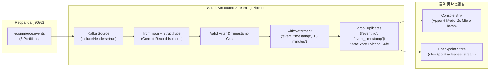

# Milestone 3: Spark Structured Streaming 기반 데이터 정제 및 중복 제거

> **소요 마일스톤**: Milestone 3  
> **상태**: 완료 (Verified)  
> **핵심 키워드**: Spark Structured Streaming, PySpark 4.2.0, Watermarking, StateStore Deduplication, Corrupt Record Isolation, Checkpointing

---

## 1. 아키텍처 개요 (Architecture Overview)

Milestone 3에서는 Redpanda(Kafka) 토픽 `ecommerce.events`로부터 실시간 스트림을 구독하여, JSON 역직렬화, 불량 레코드 격리, 15분 워터마크 기반 중복 제거(Deduplication)를 수행하는 실시간 정제 파이프라인을 구축했습니다.



---

## 2. Architect vs Critic 듀얼 토론을 통한 핵심 설계 결정

우리 프로젝트의 표준 규칙인 `de-debate`와 `gcp-spark` 스킬에 따라 도출된 실무 설계 결정 사항입니다.

| 설계 쟁점 | Architect 제안 | Critic 지적 및 스트레스 테스트 | 최종 실무 타협안 (Synthesis) |
| :--- | :--- | :--- | :--- |
| **JSON 파싱 & 역직렬화** | Pydantic 검증 로직을 파이썬 UDF로 Spark에 적용 | Python UDF 사용 시 JVM-Python Worker 간 IPC 직렬화(Py4J)로 처리량 10배 폭락 | Spark Catalyst Optimizer가 최적화하는 **네이티브 `from_json` + StructType**만 사용 |
| **불량 데이터 (Corrupt Record)** | 별도의 카프카 DLQ 토픽으로 즉시 재전송 | 초기 단계에서 멀티 토픽 발행은 관리 복잡도 및 오버엔지니어링(YAGNI) 유발 | Spark 내장 옵션 `columnNameOfCorruptRecord`를 활용해 **`_corrupt_record` 컬럼 격리 및 필터링** |
| **중복 제거 (Deduplication)** | `dropDuplicates(["event_id"])` 단순 적용 | 워터마크 없는 중복 제거는 StateStore(메모리/RocksDB)에 ID가 영구 누적되어 **Executor OOM 폭발** | **`withWatermark("event_timestamp", "15 minutes")` 선언 후 워터마크 컬럼을 중복 제거 키에 함께 지정**하여 오래된 상태 자동 정리(Eviction) |
| **워터마크 임계값** | 메모리 절약을 위해 5분 워터마크 설정 | `generator.py`에서 최대 10분 지연 데이터(`randint(3, 10)`)를 주입하므로 5분 설정 시 지연 데이터가 무조건 폐기됨 | 지연 데이터가 정상적으로 수용 및 버퍼링되도록 **워터마크를 15분으로 설정** |
| **내결함성 (Fault Tolerance)** | 콘솔 출력만 띄워 실시간 확인 | 장애 복구(FT)를 증명하지 못하면 실무 파이프라인으로 인정받을 수 없음 | **`checkpointLocation` 디렉터리를 강제**하여 프로세스 재시작 시 오프셋 및 상태 복구 보장 |

---

## 3. 핵심 구현 코드 (`pipelines/streaming/cleanse_stream.py`)

### ① Kafka 헤더 및 본문 추출
```python
# 💡 includeHeaders=true로 W3C traceparent 분산 추적 헤더 추출
traceparent_expr = expr("filter(headers, h -> h.key = 'traceparent')[0].value").cast("string")

parsed_df = kafka_raw_df.select(
    col("partition").alias("kafka_partition"),
    col("offset").alias("kafka_offset"),
    col("timestamp").alias("broker_timestamp"),  # Clock Skew 방어
    traceparent_expr.alias("traceparent"),
    from_json(
        col("value").cast("string"),
        ecommerce_event_schema,
        {"columnNameOfCorruptRecord": "_corrupt_record"}
    ).alias("data")
)
```

### ② OOM 방지 워터마크 & 상태 기반 중복 제거
```python
# 💡 StateStore 메모리 무한 누수를 차단하는 엔터프라이즈급 중복 제거
deduped_df = (
    clean_df
    .withWatermark("event_timestamp", "15 minutes")
    .dropDuplicates(["event_id", "event_timestamp"])
)
```

---

## 4. 검증 증거 (Verification Evidence)

### 1) 단위 테스트 (`tests/test_dedup.py`)
동일한 `(event_id, event_timestamp)`를 가진 중복 이벤트와 지연 이벤트가 포함된 4건의 테스트 데이터를 주입하여 검증했습니다:
```bash
$ python -m unittest tests/test_dedup.py
Ran 1 test in 4.393s
OK
```
* **결과**: 중복 1건이 정확히 드롭되어 3건만 통과함을 확인.

### 2) Kafka 스트리밍 배치 실행 결과
```bash
$ python -m pipelines.streaming.cleanse_stream --once --starting-offsets earliest
```
```text
-------------------------------------------
Batch: 0
-------------------------------------------
+---------------+------------+-----------------------+-------------------------------------------------------+------------------------------------+-------------+--------------------------+---------+------------------------------------+---------------+------------------------------------+----------+------------------+--------------------------------------------------------------+------------+--------------+-------------------+
|kafka_partition|kafka_offset|broker_timestamp       |traceparent                                            |event_id                            |event_type   |event_timestamp           |user_id  |session_id                          |sequence_number|correlation_id                      |product_id|order_id          |items                                                         |total_amount|payment_method|cancellation_reason|
+---------------+------------+-----------------------+-------------------------------------------------------+------------------------------------+-------------+--------------------------+---------+------------------------------------+---------------+------------------------------------+----------+------------------+--------------------------------------------------------------+------------+--------------+-------------------+
|0              |24          |2026-09-24 08:23:08.088|00-1fa378f048b3433b824301df48b14fb8-072a0977e3674d1d-01|cc15e7d0-a6e7-48f0-aa64-185ed8f58aab|add_to_cart  |2026-09-24 08:23:08.088318|user_0059|0ce99705-81ea-438a-86bd-c7716c37d55d|4              |d62f636e-fc83-409f-90c3-9146be9c7859|PROD_007  |NULL              |NULL                                                          |NULL        |NULL          |NULL               |
|0              |25          |2026-09-24 08:23:08.143|00-ba9803098630403c86fa005b0961d4b2-c993413f2e324125-01|34e5fced-ffe6-4094-adbb-5975a32b36cc|order_created|2026-09-24 08:23:08.143623|user_0059|0ce99705-81ea-438a-86bd-c7716c37d55d|5              |d62f636e-fc83-409f-90c3-9146be9c7859|NULL      |ord_1790205788_948|[{PROD_007, 미니멀 레더 크로스 바디백, 잡화, 45000, 2}]       |90000       |easy_pay      |NULL               |
+---------------+------------+-----------------------+-------------------------------------------------------+------------------------------------+-------------+--------------------------+---------+------------------------------------+---------------+------------------------------------+----------+------------------+--------------------------------------------------------------+------------+--------------+-------------------+
```

---

## 5. 2026 데이터 엔지니어 면접 대비 핵심 Q&A

### Q1. Spark Structured Streaming에서 중복 제거(dropDuplicates) 시 워터마크(Watermark)가 왜 필수적인가요?
> **답변:**  
> "워터마크 없이 `dropDuplicates`를 실행하면, Spark는 지금까지 확인한 모든 키를 메모리(StateStore)에 무기한 유지해야 합니다. 스트리밍이 며칠 이상 장기 실행되면 상태 크기가 무한히 증가하여 **Executor OOM(Out of Memory)으로 파이프라인이 중단**됩니다.  
> `withWatermark`를 선언하고 워터마크 컬럼(`event_timestamp`)을 중복 제거 키에 함께 포함시키면, **워터마크 임계값을 지난 오래된 상태가 StateStore에서 주기적으로 정리(Eviction)** 되므로 고정된 메모리 크기 내에서 안정적인 스트리밍 운영이 가능합니다."

### Q2. Spark Structured Streaming에서 Python UDF 사용을 지양해야 하는 이유는 무엇인가요?
> **답변:**  
> "PySpark는 JVM 위에서 동작하는 Spark Core와 Python Worker 프로세스가 Py4J 소켓을 통해 통신합니다.  
> Python UDF를 호출하면 매 레코드마다 **JVM $\rightarrow$ Python 직렬화, 파이썬 인터프리터 연산, Python $\rightarrow$ JVM 역직렬화** 과정이 발생하여 막대한 IPC 오버헤드가 발생하고 처리량이 10배 이상 급감합니다. 또한 Spark의 핵심 최적화 엔진인 **Catalyst Optimizer와 Tungsten 코드 생성기**의 혜택을 전혀 받지 못합니다. 따라서 네이티브 내장 함수(`from_json`, `to_timestamp`)와 `StructType` 스키마만을 사용하여 모든 처리를 JVM 내부에서 고속 실행해야 합니다."

### Q3. 스트리밍 쿼리에서 `checkpointLocation`의 역할은 무엇인가요?
> **답변:**  
> "`checkpointLocation`은 스트리밍 엔진이 Kafka 소스에서 어디까지 읽었는지 나타내는 **오프셋(Offsets)** 과, 워터마크 및 중복 제거에 사용되는 **상태 저장소(StateStore)** 의 스냅샷을 영속적 스토리지에 주기적으로 기록하는 장소입니다.  
> 스트리밍 노드가 예기치 않게 다운되더라도, 재시작 시 체크포인트에서 마지막 커밋 오프셋과 상태를 그대로 복원하여 데이터 유실 없는 **At-Least-Once 및 멱등성 기반의 Exactly-Once 엔드투엔드 처리**를 보장합니다."
