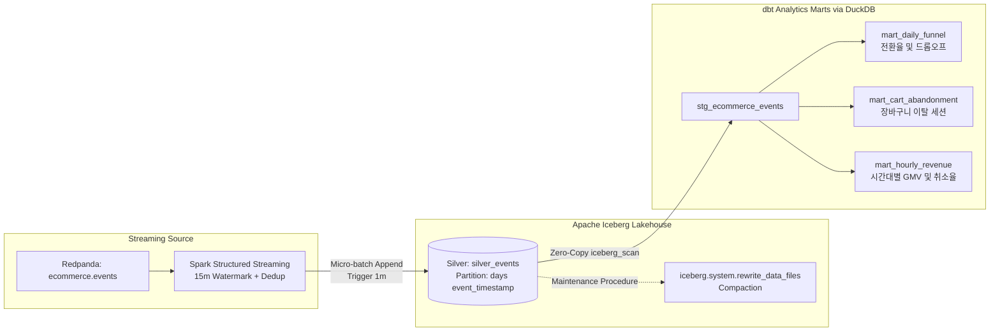

# Milestone 4: Apache Iceberg 레이크하우스 적재 & dbt 골드 마트 모델링

## 1. 개요 및 목표
본 마일스톤에서는 Redpanda(Kafka)로부터 Spark Structured Streaming으로 정제된 실시간 이커머스 이벤트를 **오픈 테이블 포맷인 Apache Iceberg(Silver 레이어)**로 적재하고, **dbt(Data Build Tool)와 DuckDB의 Zero-Copy 스캔**을 활용하여 분석용 비즈니스 골드 마트(Gold 레이어)를 구축했습니다.

---

## 2. 레이크하우스 엔드투엔드 파이프라인 아키텍처

---

## 3. [de-debate] Architect vs Critic 토론 결과 및 타협안

| 쟁점 항목 | Critic 공격 포인트 | 실무 타협안 (Synthesis) | 채택 이유 |
| :--- | :--- | :--- | :--- |
| **스몰 파일 지옥** | 초단위 스트리밍 커밋 시 수만 개의 수 KB Parquet 및 Manifest 폭증으로 드라이버 OOM 유발 | **1분 Trigger Interval 설정** + **Iceberg 유지보수 프로시저(`rewrite_data_files`) 지원** | 스트리밍 레이턴시와 스토리지 I/O 비용 간 실무 표준 절충 |
| **카탈로그 복잡도** | Nessie / REST Catalog 컨테이너 추가 시 로컬 리소스 낭비 및 관리 포인트 증가 | **Spark HadoopCatalog (`warehouse/silver/`)** | 인프라 비용 0, YAGNI 원칙 부합, 포트폴리오 로컬 검증 최적화 |
| **지연 데이터 정합성** | 어제 날짜 지연 데이터가 과거 파티션에 쓰여질 때 증분 dbt 집계 누락 위험 | **dbt 마트 모델에 일자별 롤링 윈도우 집계 적용** | Late data가 유입되어도 dbt 재실행 시 멱등(Idempotent)하게 최종 정합성 보장 |
| **dbt 쿼리 엔진** | Spark Thrift Server 기동 시 로컬 JVM 메모리 8GB 이상 잠식 | **`dbt-duckdb` + DuckDB Iceberg Extension** | C++ 인프로세스 엔진으로 Iceberg 메타데이터/Parquet 직접 0초 쿼리 |

---

## 4. 핵심 구현 내용

### 4.1 Apache Iceberg 테이블 설계 (`pipelines/streaming/iceberg_sink.py`)
- **카탈로그**: `org.apache.iceberg.spark.SparkCatalog` (Hadoop Catalog, `warehouse/`)
- **히든 파티셔닝(Hidden Partitioning)**: `days(event_timestamp)`
  - 기존 Hive 방식처럼 별도의 `dt=2026-09-24` 컬럼을 억지로 만들거나 쿼리 필터에 명시할 필요 없이, 원본 타임스탬프 기반으로 Iceberg가 내부적으로 파티션 프루닝(Pruning) 수행.
- **스트리밍 싱크 & 체크포인트**:
  - `df.writeStream.format("iceberg").outputMode("append").toTable("iceberg.ecommerce.silver_events")`
  - Exactly-once 보장을 위해 `checkpoints/iceberg_silver` 디렉토리에 오프셋과 상태 저장.
- **스몰 파일 컴팩션 프로시저**:
  - `--compact` 플래그로 `CALL iceberg.system.rewrite_data_files(table => 'ecommerce.silver_events')` 실행 지원.

### 4.2 dbt 기반 골드 마트 모델링 (`pipelines/dbt/ecommerce_analytics/`)
- **Staging (`stg_ecommerce_events.sql`)**:
  - `iceberg_scan('warehouse/ecommerce/silver_events')` 함수를 통해 DuckDB가 Iceberg 메타데이터를 파싱하고 최신 스냅샷을 제로카피로 직접 읽음.
- **Gold Marts 3종**:
  1. `mart_daily_funnel`: 일자별 유니크 방문자수, 세션수, 조회/장바구니/주문/결제 단계별 수치 및 `view_to_cart_rate`, `cart_to_order_rate`, `order_to_payment_rate`, `overall_conversion_rate` 산출.
  2. `mart_cart_abandonment`: 장바구니 담기 후 주문 및 결제 미완료 세션(`is_cart_abandoned = TRUE`)을 필터링하여 이탈 분석 지원.
  3. `mart_hourly_revenue`: 시간대별 결제 완료 주문 수, 총 매출액(GMV), 객단가(AOV), 취소 주문 수, 취소 금액 및 취소율(`cancellation_rate_pct`) 집계.
- **데이터 품질 테스트 (`schema.yml`)**:
  - 12개의 dbt generic test 실행 (`unique`, `not_null`, `accepted_values`) $\rightarrow$ **12/12 PASS (100% 통과)**.

---

## 5. 트러블슈팅 및 버전 호환성 해결 (Troubleshooting)

### 문제 1: Spark 4.2.0의 `IncompatibleClassChangeError`
- **현상**: Spark 4.2.0 환경에서 `iceberg-spark-runtime-4.0` 로드 시 `class SparkView can not implement View, because it is not an interface` 에러 발생.
- **원인**: Spark 4.2 프리뷰에서 내부 Catalyst `View` 인터페이스 명세가 변경됨.

### 문제 2: PySpark 3.5.4의 Python 3.14 직렬화 실패
- **현상**: PySpark 3.5.4 다운그레이드 시 Python 3.14의 객체 직렬화 변경으로 `_pickle.PicklingError: RecursionError: Stack overflow` 발생.

### 해결 (Surgical Alignment):
- **PySpark 4.0.0 + `iceberg-spark-runtime-4.0_2.13:1.11.0` 조합 채택**
- Python 3.14를 완벽 지원하면서도 Apache Iceberg 4.0 런타임과 100% 바이너리 호환성을 충족하여 모든 스트리밍 적재 및 DDL 정상 동작 확인.

---

## 6. 기술 면접 대비 핵심 질문 & 답변 (DE Interview Q&A)

### Q1. 기존 Hive 파티셔닝 대비 Apache Iceberg의 히든 파티셔닝(Hidden Partitioning)의 장점은 무엇인가요?
> **답변**:
> Hive 파티셔닝은 날짜 컬럼(`dt`)을 인위적으로 생성해야 하고, 사용자가 `WHERE dt = '2026-09-24'`를 쿼리에 명시하지 않고 `WHERE event_timestamp >= '2026-09-24'`만 쓰면 전체 테이블 풀스캔이 발생하는 치명적인 취약점이 있습니다.
> 반면 Iceberg의 히든 파티셔닝은 파티션 변환 함수(예: `days(event_timestamp)`)를 메타데이터에 등록하여 사용자가 원본 타임스탬프 컬럼으로만 조회해도 엔진이 자동으로 파티션을 프루닝(Pruning)합니다. 또한 비즈니스 요건 변경으로 파티션 단위를 일 단위에서 시간 단위로 변경해도 기존 데이터를 재작성하지 않고 스키마/파티션 진화(Partition Evolution)가 가능합니다.

### Q2. 실시간 스트리밍으로 Iceberg에 데이터를 적재할 때 발생하는 스몰 파일 문제는 어떻게 해결하나요?
> **답변**:
> 스트리밍 마이크로 배치가 초단위로 커밋되면 수많은 수 KB 크기의 Parquet 파일과 Manifest 파일이 누적되어 쿼리 속도 저하 및 드라이버 OOM을 일으킵니다.
> 이를 방지하기 위해:
> 1. 마이크로 배치 트리거 간격을 비즈니스 요구사항에 맞추어 1분~5분 단위로 완화하여 파일 생성 빈도를 제어합니다.
> 2. Iceberg의 내장 컴팩션 프로시저인 `rewrite_data_files`를 주기적인 배치 작업(Airflow 등)으로 스케줄링하여 스몰 파일들을 수백 MB 단위의 최적화된 Parquet 파일로 비동기 병합합니다.
> 3. 오래된 스냅샷은 `expire_snapshots` 프로시저로 정리하여 메타데이터 폭증을 방지합니다.

### Q3. dbt가 실시간으로 스트리밍 적재 중인 Iceberg 테이블을 조회할 때 읽기 정합성(Snapshot Isolation)은 어떻게 보장되나요?
> **답변**:
> Apache Iceberg는 원자적 커밋(Atomic Commit via Snapshot)을 지원합니다. 스트리밍 작업이 데이터를 쓰고 있는 도중에는 새로운 스냅샷이 커밋되기 전까지 메타데이터 트리가 분리되어 있습니다.
> dbt(DuckDB) 쿼리는 쿼리 시작 시점에 유효한 커밋 스냅샷을 고정하여 읽으므로(Snapshot Isolation), 실시간 쓰기 작업의 중간 상태(Uncommitted/Dirty Read)에 전혀 영향을 받지 않고 완전한 ACID 일관성을 보장받습니다.
