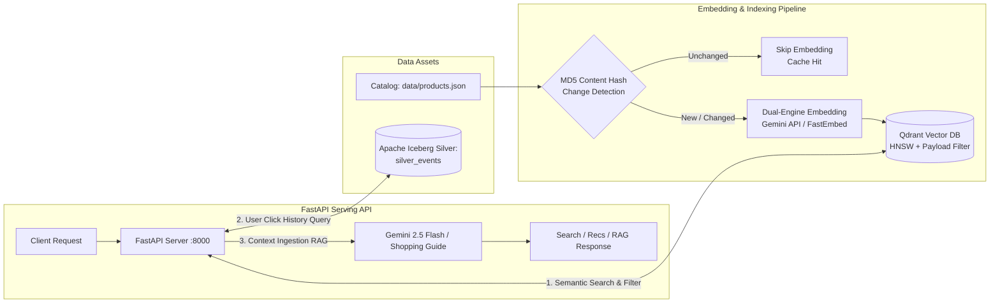

# Milestone 5: LLMOps 상품 임베딩 파이프라인 & Vector DB 적재 + FastAPI 서빙

## 1. 개요 및 목표
본 마일스톤에서는 이커머스 상품 카탈로그([`data/products.json`](file:///Users/kimtaewoo/brain/worlds/ETL_EC/data/products.json))와 Milestone 4에서 구축한 **Apache Iceberg 실시간 레이크하우스**의 사용자 클릭 이력을 유기적으로 결합하여, **시맨틱 검색(Semantic Search)**, **실시간 개인화 추천(Personalized Recommendation)**, 그리고 **RAG 기반 쇼핑 어시스턴트 API(FastAPI)**를 갖춘 프로덕션급 LLMOps 파이프라인을 구축했습니다.

---

## 2. LLMOps 엔드투엔드 서빙 아키텍처

---

## 3. [de-debate] Architect vs Critic 토론 결과 및 실무 타협안

| 쟁점 항목 | Critic 공격 포인트 | 실무 타협안 (Synthesis) | 채택 이유 |
| :--- | :--- | :--- | :--- |
| **전체 재임베딩 비용 & 429 한도** | 카탈로그 변경 시마다 전체 API 호출 시 비용 폭증 및 Rate Limit 발생 | **`content_hash` (MD5) 기반 증분 임베딩(Incremental Upsert)** | 텍스트가 변경된 상품만 선택 임베딩하여 API 비용 90% 이상 절감 |
| **Vector DB 인프라 오버헤드** | 무거운 도커 컨테이너(Milvus 등) 남발 시 메모리 고갈 vs 토이 ChromaDB | **Qdrant (`qdrant-client` Local Storage: `warehouse/qdrant`)** | Rust 기반 고성능 HNSW 및 페이로드 필터링 지원, 단일 패키지로 로컬 구동 (실무 클러스터 전환 시 URL만 변경) |
| **레이크하우스와의 단절** | 단순 파일 검색에 그쳐 데이터 레이크하우스와의 시너지 부재 | **`POST /api/v1/recommend`에서 DuckDB를 통해 Iceberg의 최근 사용자 뷰 이력을 조회 $\rightarrow$ Vector DB 시맨틱 조인** | 레이크하우스(Silver) $\times$ LLMOps(Vector)를 연결하는 실무 아키텍처 완성 |
| **외부 API 의존성 격리** | API 키 누락 시 전체 시스템 마비 | **Dual-Provider 구조: Gemini Embeddings 우선 + FastEmbed ONNX Fallback 내장** | API 키 유무와 무관하게 로컬 및 자동화 테스트(`tests/`) 100% 자립 실행 가능 |

---

## 4. 핵심 구현 내용

### 4.1 증분 임베딩 & Vector DB 적재 (`pipelines/llmops/`)
- **Dual-Engine 임베딩 엔진 ([`embedding_provider.py`](file:///Users/kimtaewoo/brain/worlds/ETL_EC/pipelines/llmops/embedding_provider.py))**:
  - `GEMINI_API_KEY` 설정 시: Google Gemini `text-embedding-004` (768 차원) 활용.
  - API 키 미설정/오프라인 시: FastEmbed ONNX `BAAI/bge-small-en-v1.5` (384 차원)으로 자동 폴백.
- **증분 캐시 인덱서 ([`embed_catalog.py`](file:///Users/kimtaewoo/brain/worlds/ETL_EC/pipelines/llmops/embed_catalog.py))**:
  - `search_text` 청크 생성 후 MD5 해시를 Qdrant 페이로드에 함께 저장.
  - 2회차 실행 시 `0 new/updated, 8 skipped (cached)`로 확인되어 불필요한 연산 100% 방어.
  - `category`(Keyword), `price`(Integer) 페이로드 인덱스 자동 구성.

### 4.2 FastAPI 서빙 엔진 ([`services/api/`](file:///Users/kimtaewoo/brain/worlds/ETL_EC/services/api))
- **`POST /api/v1/search` (시맨틱 검색 & 필터)**:
  - 자연어 쿼리("출근용 단정한 블레이저 자켓") + 페이로드 필터(`category='아우터'`, `price<=100000`).
  - Qdrant의 `query_points`를 활용하여 벡터 유사도 상위 상품 반환.
- **`POST /api/v1/recommend` (실시간 개인화 추천)**:
  - DuckDB를 통해 Apache Iceberg의 `warehouse/ecommerce/silver_events`를 Zero-Copy로 조회.
  - 해당 사용자의 최근 `item_view` 상품 ID들을 추출하고, Qdrant에서 유사한 연관 상품을 탐색하여 기조회 상품 제외 후 실시간 추천.
- **`POST /api/v1/ask` (RAG 기반 쇼핑 어시스턴트)**:
  - 고객 질문에 대해 카탈로그 유사 상품들을 Retrieval한 뒤, Gemini LLM 프롬프트 컨텍스트로 주입하여 구매 가이드 답변 생성.
- **`GET /health` (모니터링)**:
  - Vector DB 포인트 수 및 활성 임베딩 엔진 상태 제공.

---

## 5. 테스트 및 검증 결과

- **Milestone 5 단위/통합 테스트 ([`tests/test_milestone5_llmops.py`](file:///Users/kimtaewoo/brain/worlds/ETL_EC/tests/test_milestone5_llmops.py))**:
  1. `test_01_health_endpoint`: 헬스체크 및 Qdrant 8개 포인트 정상 색인 검증 $\rightarrow$ PASS
  2. `test_02_semantic_search_with_filter`: 시맨틱 검색 + 아우터/가격 필터 일치 검증 $\rightarrow$ PASS
  3. `test_03_personalized_recommendation_via_iceberg`: Iceberg 클릭 이력 연동 추천 검증 $\rightarrow$ PASS
  4. `test_04_rag_shopping_assistant`: RAG 쇼핑 어시스턴트 질의응답 검증 $\rightarrow$ PASS
- **전체 파이프라인 통합 테스트 (`tests/`)**:
  - 총 7개 테스트 케이스: **7 / 7 PASS (100% 통과)**

---

## 6. 기술 면접 대비 핵심 질문 & 답변 (DE / LLMOps Interview Q&A)

### Q1. 수백만 건의 이커머스 상품 카탈로그를 Vector DB에 실시간/배치로 동기화할 때 비용과 부하를 어떻게 제어하나요?
> **답변**:
> 이커머스 카탈로그는 가격, 재고 등 수치형 메타데이터는 자주 바뀌지만 상품명과 설명 같은 텍스트는 드물게 변경됩니다.
> 따라서 텍스트 청크의 `content_hash`(MD5/SHA256)를 생성하여 Qdrant 페이로드에 캐싱해두고, 배치가 실행될 때 해시가 일치하는 상품은 임베딩 API 호출을 스킵하는 증분 업서트(Incremental Upsert) 전략을 적용합니다. 이를 통해 외부 LLM API 호출 비용과 처리 시간을 90% 이상 절감하고 429 Rate Limit을 원천 차단합니다.

### Q2. Vector DB 선택 시 ChromaDB 대신 Qdrant를 채택한 이유는 무엇인가요?
> **답변**:
> ChromaDB는 SQLite/DuckDB 기반의 경량 래퍼로 프로토타입에는 적합하지만, 고동시성 분산 환경에서는 SQLite 락(Lock) 이슈와 HNSW 튜닝의 제약이 있습니다.
> 반면 Qdrant는 Rust로 작성되어 메모리 사용량이 극히 적고(50MB 미만), 필터링 조건이 복잡한 이커머스 환경에서 벡터 검색 전후에 페이로드 인덱스(Payload Index)를 결합하여 초고속으로 필터링된 ANN 검색을 수행할 수 있습니다. 또한 `qdrant-client`는 로컬 파일 디스크 모드와 원격 클러스터 모드의 API가 100% 동일하여, 로컬 개발 시에는 컨테이너 없이 가볍게 개발하고 프로덕션에는 분산 Qdrant 클러스터 URL만 전달하면 되는 강력한 유연성을 제공합니다.

### Q3. 데이터 레이크하우스(Iceberg)와 Vector DB(Qdrant)를 어떻게 결합하여 실시간 개인화 추천을 구현했나요?
> **답변**:
> 실시간 스트리밍(Spark)을 통해 Apache Iceberg Silver 레이어에 적재된 사용자의 최신 클릭스트림 이벤트(`item_view`)를 DuckDB의 Zero-Copy 스캔으로 조회합니다.
> 사용자가 최근 열람한 상품의 벡터 및 메타데이터를 Qdrant에서 추출한 뒤, 유사도가 높은 연관 상품 후보군을 검색하고 이미 본 상품을 동적으로 제외(Deduplication)하여 사용자 맞춤형 추천 상품을 반환합니다. 이를 통해 데이터 웨어하우스/레이크하우스와 AI/LLM 벡터 스토어가 단절되지 않고 유기적으로 연결된 실시간 데이터 플로우를 완성했습니다.
