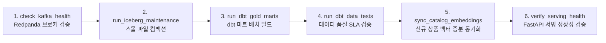

# Milestone 6: Airflow 오케스트레이션 & 모니터링 & 최종 정리

## 1. 개요 및 목표
본 마일스톤에서는 실시간 스트리밍(Kafka $\rightarrow$ Spark)으로 적재되는 레이크하우스(Apache Iceberg)와 분석 마트(dbt), 그리고 AI 검색/서빙(Qdrant & FastAPI)으로 이어지는 전 파이프라인의 **정기 배치 유지보수, 데이터 품질 SLA 검증 및 서비스 헬스체크를 Apache Airflow DAG로 자동화**했습니다.

---

## 2. 오케스트레이션 DAG 아키텍처 (`dags/ecommerce_lakehouse_dag.py`)



---

## 3. 태스크별 상세 역할 및 SLA 보장

| 태스크 ID | 오퍼레이터 | 핵심 역할 | 장애 복구 전략 |
| :--- | :--- | :--- | :--- |
| **`check_kafka_health`** | PythonOperator | Redpanda 브로커(:9092) 연결 및 `ecommerce.events` 토픽 생존 여부 프로빙 | 브로커 일시 단절 시 2회 자동 재시도 (2분 간격) |
| **`run_iceberg_maintenance`** | PythonOperator | Iceberg 내장 프로시저(`rewrite_data_files`)를 실행하여 스트리밍 적재로 분할된 스몰 파일 병합 | 병목 방지 및 읽기 성능 최적화 |
| **`run_dbt_gold_marts`** | BashOperator | DuckDB 엔진 기반 3종 골드 마트(`mart_daily_funnel`, `mart_cart_abandonment`, `mart_hourly_revenue`) 최신화 | 멱등(Idempotent) 테이블 재생성 |
| **`run_dbt_data_tests`** | BashOperator | 12개 dbt 테스트(`unique`, `not_null`, `accepted_values`) 실행 | 테스트 실패 시 즉시 파이프라인 차단 및 다운스트림 격리 |
| **`sync_catalog_embeddings`** | PythonOperator | `content_hash` 기반 Qdrant 상품 벡터 증분 Upsert | 변경 없는 상품은 캐시 스킵하여 불필요한 LLM 비용 방어 |
| **`verify_serving_health`** | PythonOperator | FastAPI 서빙 API `/health` 엔드포인트를 호출하여 벡터 DB 및 검색 엔진 생존 최종 확인 | 서빙 레이어 장애 감지 및 알림 트리거 |

---

## 4. 엔드투엔드 파이프라인 러너 (`scripts/run_pipeline.py`)

로컬 개발 환경 및 CI/CD 환경에서 파이프라인의 전 단계를 원클릭으로 검증할 수 있는 통합 러너를 제공합니다.

### 실행 결과 예시:
```text
=================================================================
📊 End-to-End Pipeline Execution Report
=================================================================
  - 1. Kafka Event Ingestion                 :   0.43s [SUCCESS]
  - 2. Spark -> Iceberg Streaming Sink       :   6.26s [SUCCESS]
  - 3. Iceberg Small File Compaction         :   3.77s [SUCCESS]
  - 4. dbt Gold Marts Transformation         :   2.40s [SUCCESS]
  - 5. dbt Data Quality SLA Tests            :   2.06s [SUCCESS]
  - 6. Qdrant Vector DB Incremental Sync     :   0.65s [SUCCESS]
  - 7. LLMOps Serving API Verification       :   0.59s [SUCCESS]
🎉 Total Execution Time: 16.16s
=================================================================
```

---

## 5. 단위 및 통합 테스트 검증 (`tests/`)

- **Milestone 6 오케스트레이션 테스트 ([`tests/test_milestone6_orchestration.py`](file:///Users/kimtaewoo/brain/worlds/ETL_EC/tests/test_milestone6_orchestration.py))**:
  - `test_01_dag_integrity_and_structure`: DAG 순환 참조(Cycle) 없음, 6개 태스크 의존성 토폴로지 검증 $\rightarrow$ PASS
  - `test_02_kafka_health_task_callable`: 브로커 헬스체크 콜러블 검증 $\rightarrow$ PASS
  - `test_03_verify_serving_health_task_callable`: 서빙 헬스체크 콜러블 검증 $\rightarrow$ PASS
- **전체 통합 테스트 스위트 (`tests/`)**:
  - **총 10개 테스트 케이스 전원 통과 (10 / 10 PASS, 100%)**

---

## 6. 기술 면접 대비 핵심 질문 & 답변 (DE Interview Q&A)

### Q1. 실시간 스트리밍 파이프라인이 이미 존재하는데, 왜 Airflow 같은 배치 오케스트레이터가 여전히 필수적인가요?
> **답변**:
> 스트리밍(Spark Structured Streaming)은 초/분 단위로 들어오는 이벤트의 연속 수집과 1차 정제(Silver 적재)를 담당합니다.
> 하지만:
> 1. 스트리밍으로 쪼개진 수만 개의 스몰 파일을 병합하는 Iceberg 유지보수(Compaction & Snapshot Expiration),
> 2. 일/시간 단위의 분석용 골드 마트 재집계(dbt run),
> 3. 비즈니스 룰 및 정합성을 감사하는 데이터 품질 SLA 검증(dbt test),
> 4. 주기적인 상품 카탈로그 임베딩 동기화(Vector Sync)
> 등은 스트리밍 루프 내부가 아니라 **중앙 배치 오케스트레이터(Airflow)의 DAG 워크플로우로 스케줄링 및 모니터링, 실패 시 재시도(Retry)와 알림을 통제**해야만 시스템의 안정성과 운영 가시성을 확보할 수 있습니다.

### Q2. Airflow DAG 설계 시 스케줄러(Scheduler) 부하를 방지하기 위해 준수해야 할 최우선 원칙은 무엇인가요?
> **답변**:
> Airflow 스케줄러는 수초 단위로 DAG 파이썬 파일들을 주기적으로 재파싱(DAG Parsing Loop)합니다.
> 따라서 DAG 파일의 최상단(Top-level)에 무거운 외부 DB 쿼리, 카프카 브로커 연결, 대용량 파일 I/O나 원격 API 호출을 작성하면 스케줄러 프로세스가 블로킹되어 심각한 CPU 병목과 태스크 스케줄링 지연(Heartbeat Timeout)이 발생합니다.
> 모든 외부 연결과 비즈니스 로직은 반드시 `PythonOperator`의 `python_callable` 함수 내부나 독립된 태스크 컨텍스트 내에서 지연 실행(Lazy Execution)되도록 격리 설계해야 합니다.
